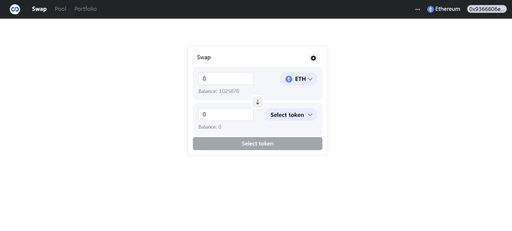

<h1 align="center">Welcome to Superswap 👋</h1>

<p align="center">
  
  
  
  
  
  
</p>



<h2 align="center"><a  href="https://getsuperswap.com/">✨Superswap Link</a></h2>


## Description
> The Superswap platform is a decentralized trading and automated market making protocol built on top of the Ethereum blockchain, which is compatible with all ERC-20 tokens and infrastructure such as wallet services like MetaMask.
#### Main contents:
  <ul>
    <li>Implement smart contracts: swap, add liquidity and remove liquidity.</li>
    <li>Test the smart contracts thoroughly using the Hardhat.</li>
    <li>Design a user-friendly interface using React.</li>
    <li>Set up a continuous integration and continuous deployment pipeline.</li>
    <li>Monitor and maintain the Superswap platform over time.</li>
  </ul>


## How to Use

#### Swap and liquidity:
- **Swap** Use one token to exchange any ERC20 token.
- **Liquidity** create new pools, or add liquidity and remove liquidity in existing pools.
- Note:- Superswap is only deployed on Goerli testnet now.

## Project setup

<b>Install</b>
```
git clone https://github.com/leidanwqq1/Superswap.git
npm install
cd frontend && npm install
```

<b>Run tests</b>
```sh
npx harthat test
```

<b>Run frontend</b>
```sh
npm start
```

## Author

👤 **Dan Lei**

* Website: https://danlei.org/
* Github: [@leidanwqq1](https://github.com/leidanwqq1)
* LinkedIn: [@DanLei](https://linkedin.com/in/https:\/\/www.linkedin.com\/in\/danleiweb3\/)

## Code Contributors

This project exists thanks to all the people who contribute.<br />
<a href="https://github.com/leidanwqq1/Superswap/graphs/contributors">
  
</a>


## 🤝 Contributing

Contributions, issues and feature requests are welcome.<br />
Feel free to check [issues page](https://github.com/leidanwqq1/Superswap/issues) if you want to contribute.<br />

## Show your support

Please ⭐️ this repository if this project helped you!

## 📝 License

Copyright © 2022 [Dan Lei](https://github.com/leidanwqq1).<br />
This project is [MIT](https://github.com/leidanwqq1/Superswap/blob/master/LICENSE) licensed.
